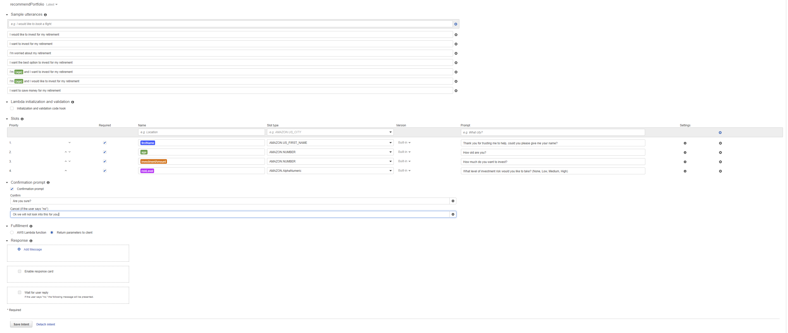
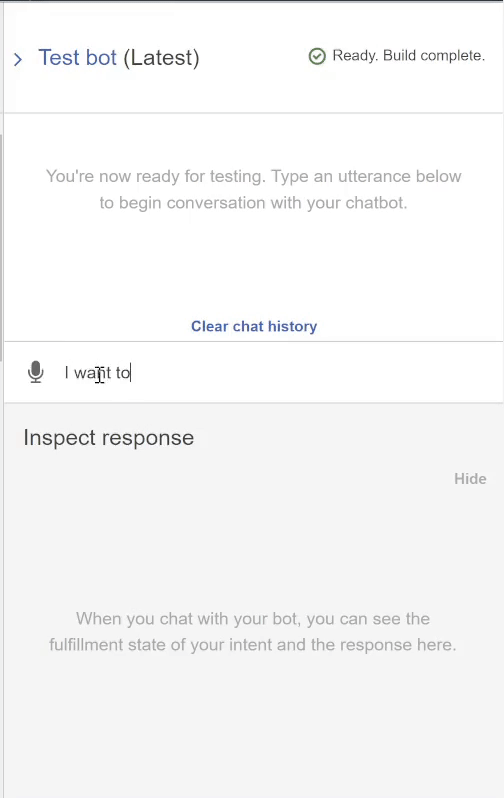
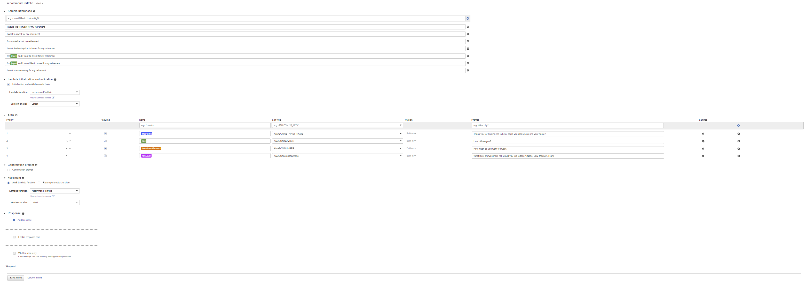
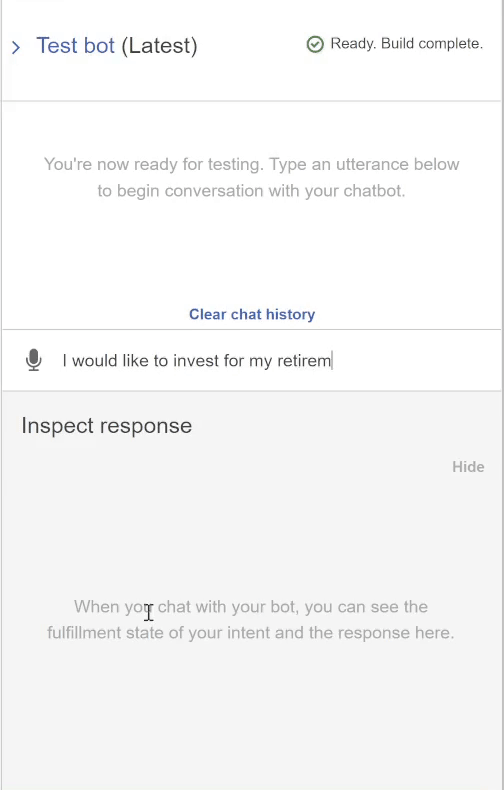

# portfolio_recommendation_chat_bot
This is a chat bot that recommends an investment portfolio for a retirement plan using AWS.

---

## Technologies

This project leverages the following technologies:

* [Amazon-Lex] (https://aws.amazon.com/lex/) - For building chat bot.

* [Amazon-Lambda] (https://aws.amazon.com/lambda/) - For connecting backend code to chat bot.

This project's lambda function uses python 3.7 with the following packages:

* [datetime] (https://github.com/zopefoundation/DateTime/blob/master/src/DateTime/DateTime.py) - For standardized datetime format.

---

## Test Events

Test events for the lambda function are pulled from the Test_Events folder.

## Usage

### General

This is designed to be run using Amazon Lex and Amazon Lambda. You will need to open an account with AWS and setup a new Amazon Lex bot named recommendPortfolio. You will also need to create a new Amazon Lambda function named recommendPortfolio. 

### Configure Initial Robo-Advisor

The initial lex chatbot should be built using the following specifications shown in the image below.

This chat-bot should have the following functionality.

### Enhance Chat-Bot with Lambda Function

This chat-bot integrates with the lambda function to return a portfolio recomendation depending on the inputs received from the user. Here are the specifications for Amazon Lex.

This chat-bot should have the following functionality.

